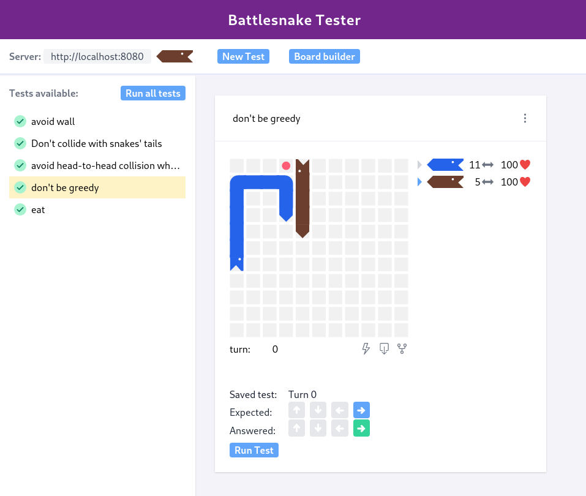

# Battlesnake Tester

Check it out at https://jfgodoy.github.io/battlesnake-tester

The app allow you to import games played in https://play.battlesnake.com/, navigate all the turns and create tests
for your server. The test created are saved locally in your browser in a IndexedDB.

This project is in active development. Suggestions of new features are welcome.

Leave a star if you found this project useful :star:

## Features

- allow import a game from https://play.battlesnake.com/ and create a test
- remove a saved test
- edit a saved test
- export test as curl
- edit a turn or create a board from scratch
- export/import database
- get played games for your snake in https://play.battlesnake.com/, to easily import them

## Acknowledgement

Many thanks to the team [BattlesnakeOfficial](https://github.com/BattlesnakeOfficial) and its [board](https://github.com/BattlesnakeOfficial/board) project from were I borrowed the display.

## Credits

[Assets used with permission from Battlesnake](https://play.battlesnake.com/)
